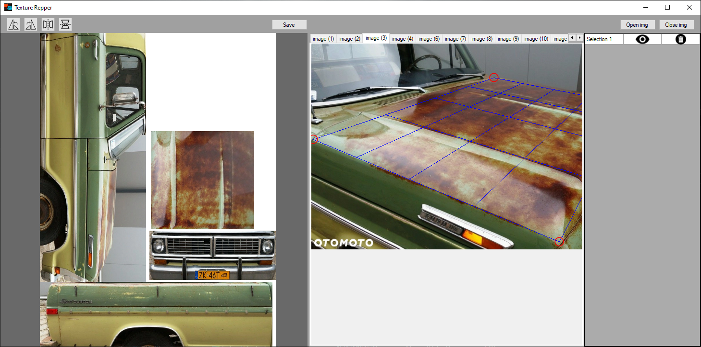
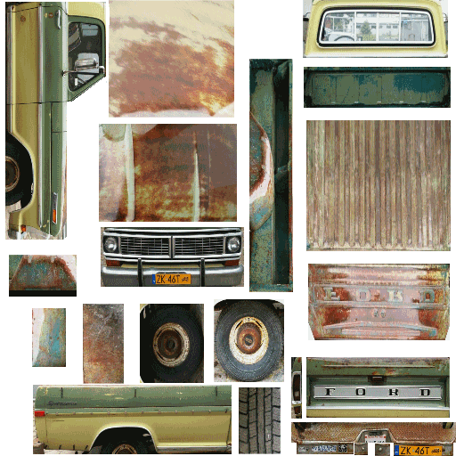
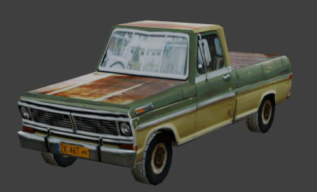

# TextureRipper

**TextureRipper** is a desktop tool for extracting textures from photos by selecting image regions and removing perspective distortion. It produces ready-to-use materials for 3D models, especially useful in retro-style and indie game development.

## Features

- Extract textures from photos with perspective correction  
- Support for popular formats: **.png, .jpg, .bmp**  
- Homography transformation with bilinear interpolation for smooth results  
- Combine textures from multiple photos into a single material  
- Simple and intuitive WinForms interface  
- Basic editing: rotation, flipping, moving, and scaling regions  

## Example Usage

### Interface


### Extracted Texture


### Applied to 3D Model


_Example: extracting car textures from photos and applying them to a 3D model._ 

## Installation

1. Clone the repository:
   ```bash
   git clone https://github.com/MtateuszAn/Texture-Ripper.git
   ```
2. Open the project in **Visual Studio** (C# / .NET WinForms).  
3. Build and run the project.  

## Usage

- **Open Image** – add a source photo  
- **Select Area** – mark a region to be extracted  
- **Transform & Adjust** – correct perspective and scale  
- **Export** – save the final texture as PNG or JPG  

## Future Improvements

Planned features for future versions:  
- Custom resolution export  
- Built-in image editor (brightness, contrast, saturation)  
- Filters and effects for texture stylization  

## License

This project is released under the **MIT License**.  
See [LICENSE](LICENSE) for details.
